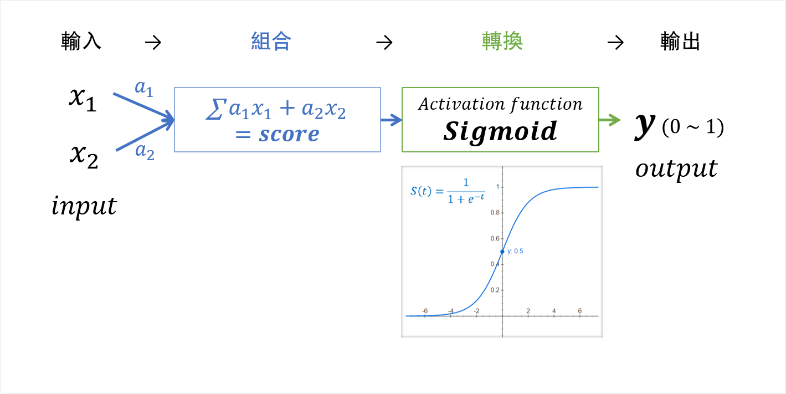
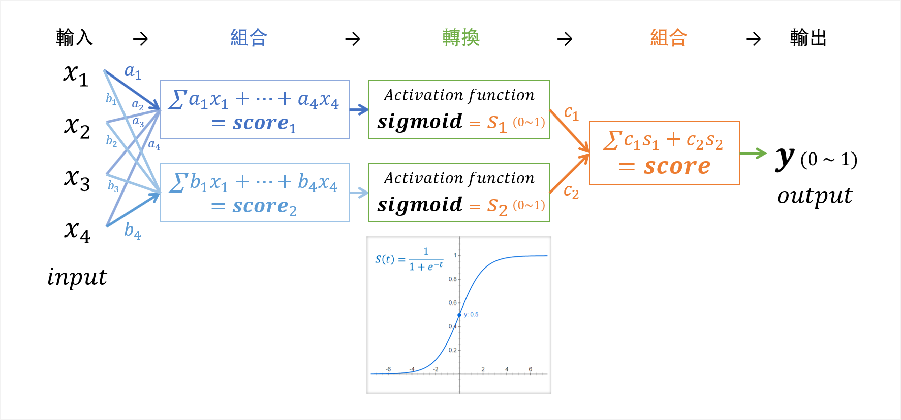
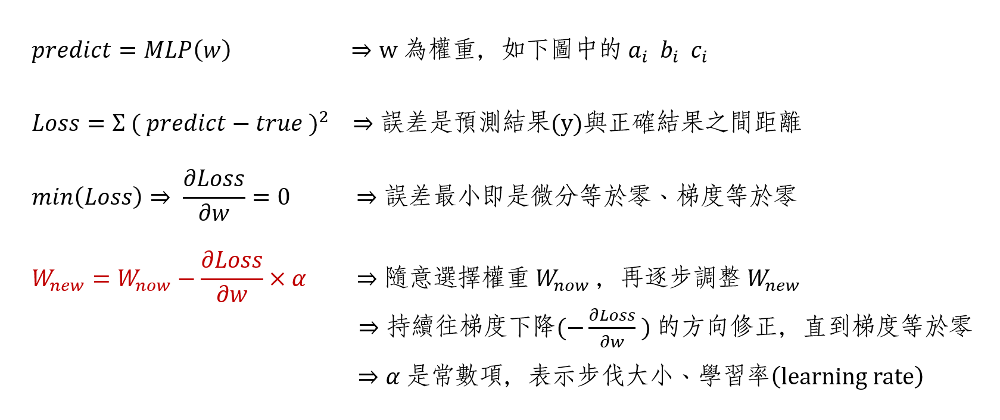
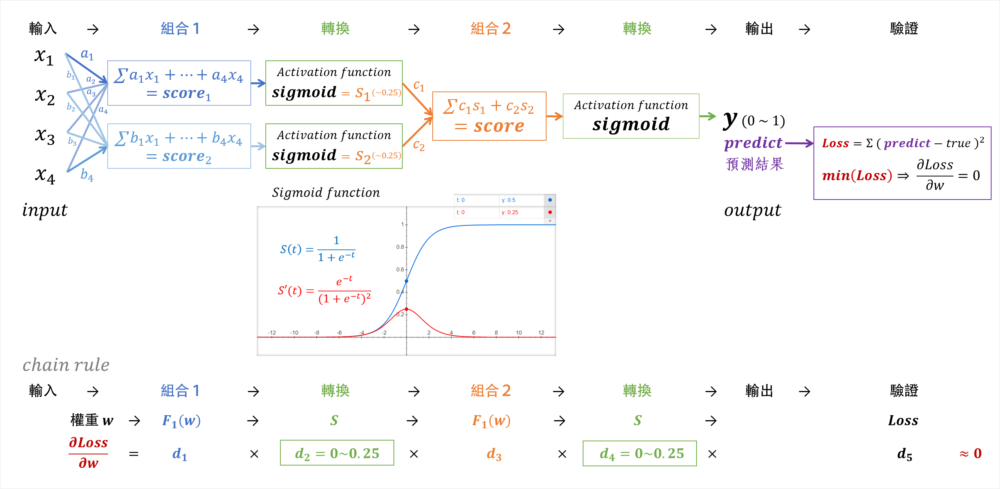
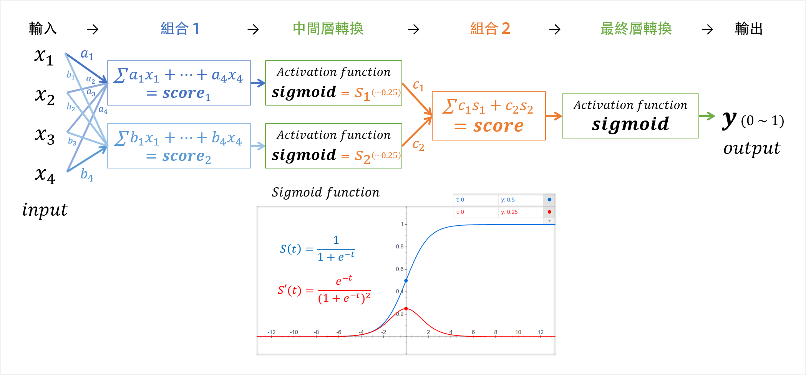
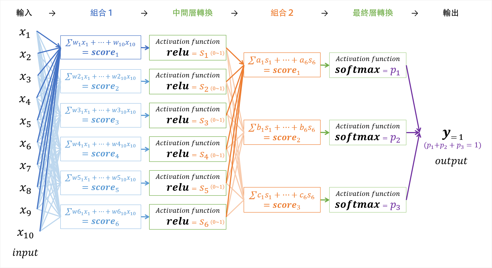

###### Date: 2020.04.20 

# 前情提要
使用 `TensorFlow` 時，可以選擇安裝或不安裝：）

## 本地運行
- 系統環境
  - 64-bit systems
  - Windows 7 or later 
  - macOS 10.12.6 (Sierra) or later (no GPU support)
- 安裝軟體
  - python 3.7
  - [TensorFlow 2](https://www.tensorflow.org/install)：`pip install tensorflow`

## 雲端運行
- [Google Colab / Colaboratory](https://colab.research.google.com/notebooks/welcome.ipynb)
  - Colab 是由 Google 提供以幫助傳播機器學習教育和研究。  
  - Colab 是一個 Jupyter notebook 環境，不需要安裝即可使用，且完全在雲端中運行。

  

# AI 基礎概念
### **機器學習**（Machine Learning）
  - 傳統統計機率 
  - 擅長處理表格（結構化資料）  
  - 資料量需要「千」筆以上，也考慮問題難度，問題若簡單則資料量可不用太多
  - 詳見：[https://github.com/yalonw/Machine_Learning](https://github.com/yalonw/Machine_Learning#ml-model-%E5%BB%BA%E7%AB%8B%E6%AD%A5%E9%A9%9F)

### **深度學習**（Deep Learning）
  - 是模仿人類大腦的認知過程，故又稱為**神經網路**
  - 是透過「**組合＋遺忘**」得到結果，而傳統統計無法做到「組合」
  - 擅長處理**圖片、文字、語言**等抽象型資料（非結構化資料）
  - 資料量需要「萬」筆以上，也考慮問題難度，問題困越難資料量需要越多

  

# DL 神經網路架構
### 1. Perceptron (單層)感知器
  - 是一種「**線性**分類器」
  - 只有一個神經元 / unit / score 
  - 分類方法為「All-or-none law 全有全無律」；只有二種選擇 output = 0 or 1
  - 缺點：只用一條線做二分法，無法解決現實問題

--------
  - 問題：二分法（output = 0 or 1）太武斷！
  - 解法：透過 **`sigmoid` 激活函數** 轉換（或稱 Logistic Regression）
  - 成果：使預測結果轉為**機率**（output = 0 ~ 1）的形式，  
    　　　而轉換後並不會改變線性分類的結果  

--------
  - 問題：線性分類不符合現實問題！
  - 解法：透過**多個**神經元 / unit / score 組合  
  - 成果：雖然每個神經元組合仍為線性分類，但中間經過 `sigmoid` 轉換，  
    　　　因此最後 output 是帶有非線性的元素

--------
### 2. Multilayer Perceptron 多層感知器（MLP）
  - 是一種「**非線性**分類器」
  - 有多條神經，多個神經元 / unit / score

--------
  - 問題：「權重（w）」如何選擇？
  - 解法：「**隨機梯度下降**（stochastic gradient descent）」
    1. 調整方式：隨意選擇權重，再逐步調整，直到誤差最小（min(Loss)），即為最佳預測結果（predict）  
    2. 調整方向：「**負斜率**（negative slope） 或 **梯度下降**（gradient descent）」的方向
       - 二維空間：- dy/dx　　　　　　     --> 負斜率  
       - 三維空間：- ( ∂x/∂z, ∂y/∂z )　　 --> 梯度下降
       - 多維空間：- ( ∂Loss/∂w1, ∂Loss/∂w2, ..., ∂Loss/∂wn )
  - 數學表示式：
    

> **誤差反向傳播**（Backpropagation）：  
  是對神經網絡中所有權重（w）計算損失函數（Loss）的梯度：∂Loss/∂w，  
  並結合隨機梯度下降（stochastic gradient descent）更新權值，以最小化損失函數。

--------
  - 問題：「梯度消失（Vanishing Gradient problem）」  
    　　　 因 `sigmoid` 激活函數的微分介於 0~0.25 之間，經過多層神經網路後，  
    　　　 會使較遠的權值沒有被校正正確，權值會越調整越差，甚至是不調整

  - 解法：將中間層激活函數從 **`sigmoid`** 改為 **`relu`**  
  - 成果：`relu` 被激活後，微分 = 1；因此在誤差反向傳播時，可以正確傳遞  

--------
  - 問題：「激活函數（Activation Function）」如何選擇？
  - **中間層** 激活函數：
      - 必定選擇 `relu`，來將「特徵組合」從線性轉成非線性分類   
      - 而不選擇 `sigmoid` 是因為經過 `sigmoid` 轉換後，  
        誤差（∂Loss/∂w）會隨著傳播越遠越被消弭，而產生「梯度消失問題」
  + **最終層** 激活函數：  
    根據需要的 output 形式來選擇，例如
      - 二元分類：選擇 `sigmoid`，讓機率介於 0 ~ 1 之間
      - 二元分類：選擇 `tanh`　　，讓機率介於 -1 ~ 1 之間
      - 多元分類：選擇 `softmax`，讓機率相加等於 1
      - 回　　歸：不需要激活函數

